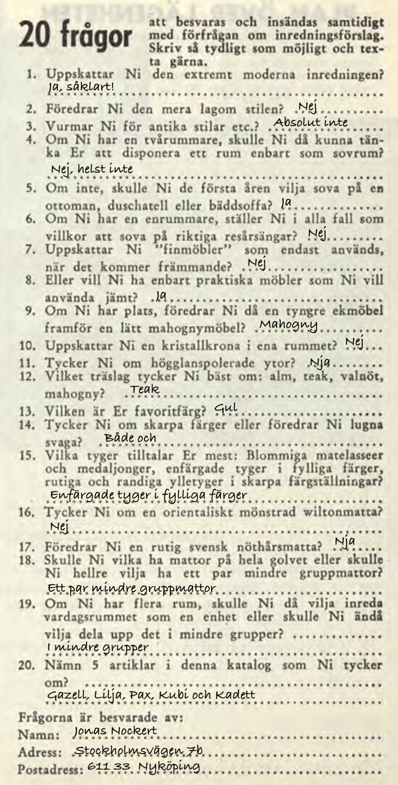
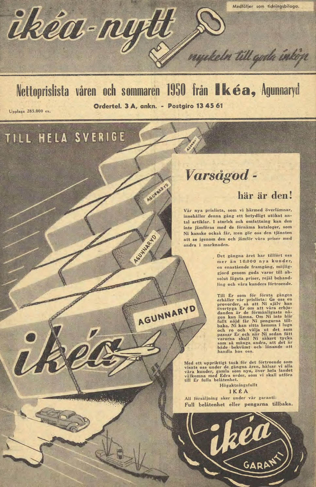
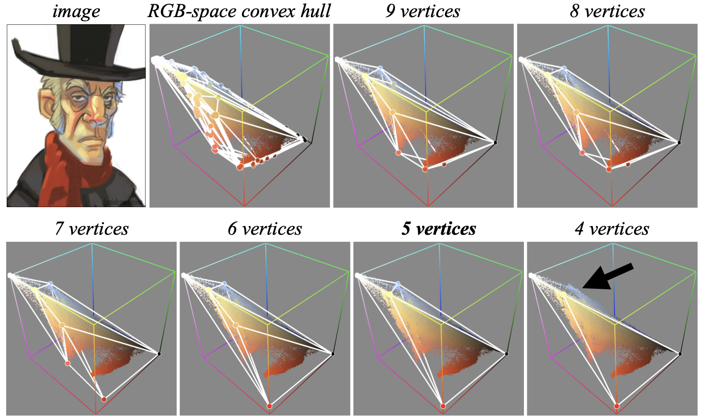
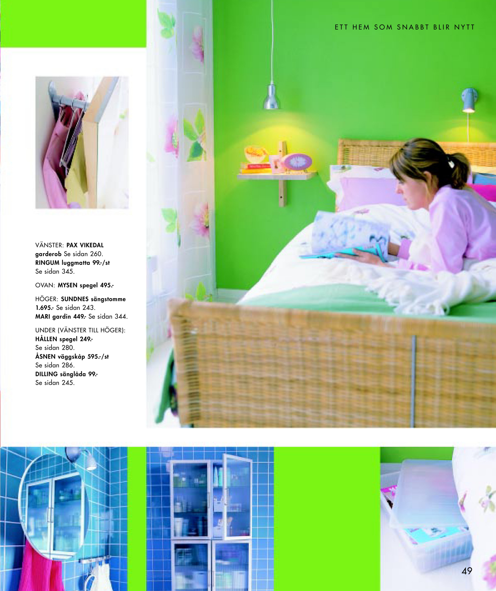
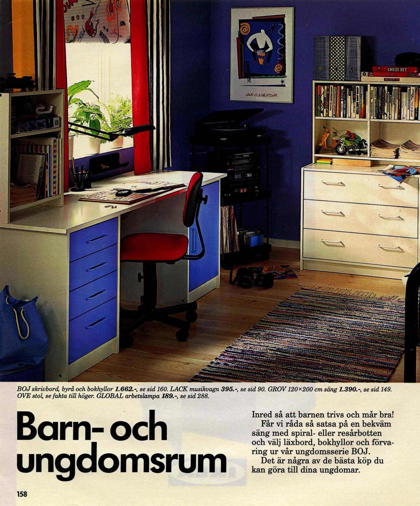
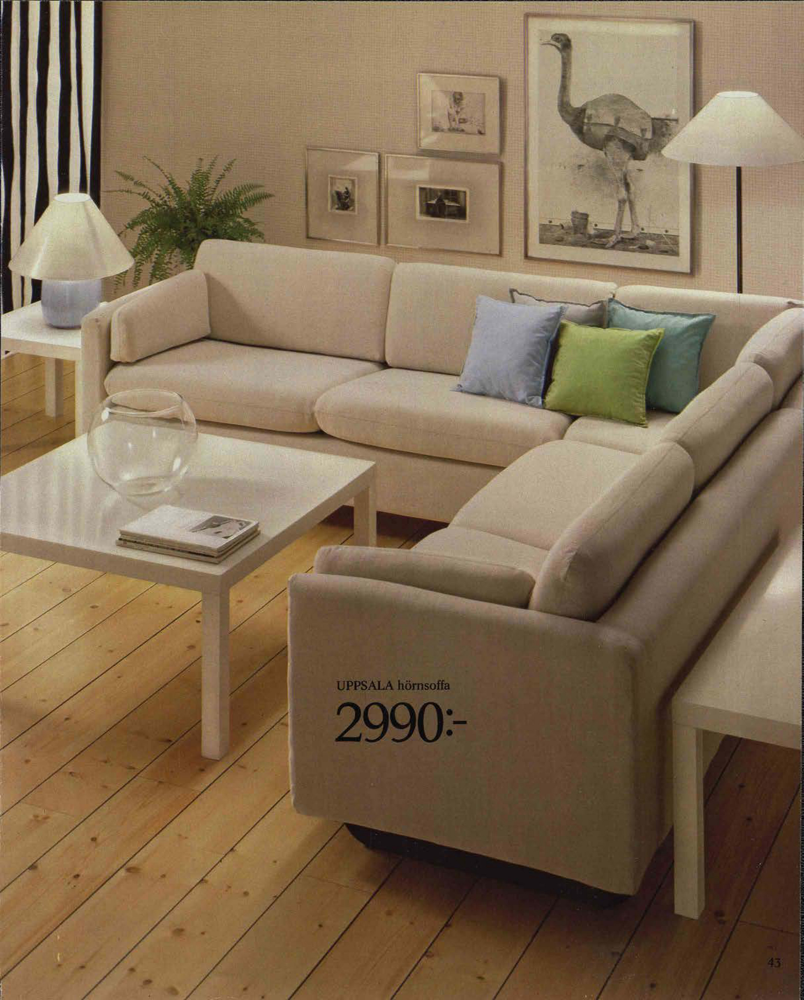
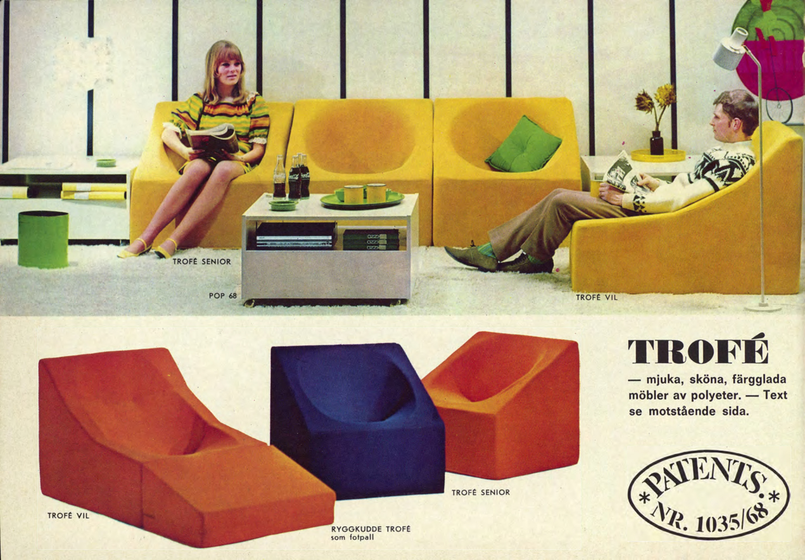
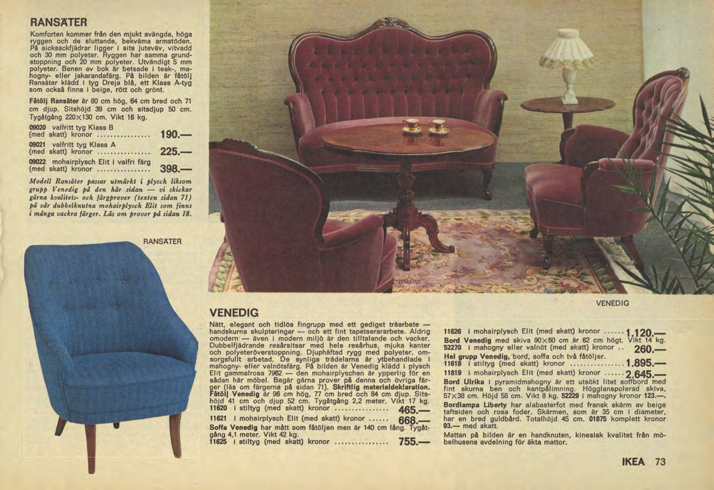

```{r setup, include=FALSE}
knitr::opts_chunk$set(echo = TRUE)
library(tidyverse)
library(ggplot2)
library(ggthemes)
library(grid)
library(gridExtra)
library(magick)
library(magrittr)
library(reticulate)
library(scales)
library(ggpomological)
library(tufte)
# 
# brew install glpk
# brew install qhull
# devtools::install_github("lemonad/colorhull")
library(colorhull)

# Use the offical IKEA typeface!
library(gfonts)
setup_font(
  id = "noto-sans",
  output_dir = "fonts"
)
use_font("noto-sans", "fonts/css/noto-sans.css")

source("colors.r")
source("plotting.r")
```


<br/>


*1950-2021: 72 years of IKEA catalog covers.*

---

```{marginfigure}


*Figure: Mail-in form from the 1955 catalog.*
```

IKEA has [all their catalogs, 1950--2021, online](https://ikeamuseum.com/sv/ikea-kataloger/),
which should represent a unique slice of time of what is popular within interior
design. IKEA worked with customer feedback from the start in order to sell just
the right products and based on their success over the years (see mail-in form
from the 1955 catalog in the margin), it seems safe to say that IKEA has
consistently offered what people want.

The question emerges if it is possible to pick up general design trends from the
catalogs, specifically when it comes to the use of color. One imagines that
both colors of products in the catalog as well as the design of the catalog
itself will follow (or drive) what is popular.


## Preprocessing
Every catalog page is a high-resolution jpeg-encoded scanned image, e.g. the
[first page of the 1950 catalog](https://ikeacatalogues.ikea.com/77436/1101577/pages/d6e4d36a-e57c-46f9-9570-292c65d79a50-at2400.jpg):

<br/>


*Figure: The front page of IKEA's first catalog.*
<br/>

```{r, cached = TRUE, include = FALSE}
years <- 1950L:2021L
total_pages <- 0L
for (year in years) {
  load(paste0("./data/stats", year, ".RData"))
  total_pages <- total_pages + length(stats_list)
}
```

The idea is to use the raw pixels of each such image to generate data for
visualization. Since it takes many days of cpu-time to process everything
(`r total_pages` pages!), by necessity, the output from the preprocessing
steps is what will be used here. All of the necessary R code for
reproducing the results can be found in the accompanying
[Github repo](https://github.com/MT5013-HT20/PR_lemonad) and R package
[colorhull](https://github.com/lemonad/colorhull).


## Pixels and colors
Each pixel in the 8-bit [RGB color space](https://en.wikipedia.org/wiki/RGB_color_space)
has 16.7 million unique combinations. The catalogs are 200-300 pages long
where each page often use far beyond 100000 colors. How do we even begin to
organize or transform this in order to be able to visualize it in a
meaningful way?


## Mean colors over time
An obvious starting point is to just find the average color for each page.

```{r}
years <- 1950L:2021L
n_colors <- 1
tile_size <- c(24, 3)
x_offset <- 45
max_n_pages <- 390

ar <- array(
  1,
  c(
    length(years) * n_colors * tile_size[[1]],
    x_offset + tile_size[[2]] * max_n_pages,
    3
  )
)
ar[, , 1] <- 1
ar[, , 2] <- 1
ar[, , 3] <- 1

y <- 1
for (year in years) {
  load(paste0("./data/stats", year, ".RData"))
  mean_colors <- lapply(stats_list, function(x) x$rgb_mean)
  x <- x_offset
  for (col in rep(mean_colors, each = tile_size[[2]])) {
    ar[y:(y + n_colors * tile_size[[1]] - 1), x, 1:3] <-
      rep(col, each = tile_size[[1]])
    x <- x + 1
  }
  y <- y + n_colors * tile_size[[1]]
}

im <- image_read(ar) %>%
  image_convert(matte = FALSE, depth = 16)
y <- 4
for (year in years) {
  im <- image_annotate(
    im,
    year,
    size = 18,
    color = "black",
    gravity = "northeast",
    location = paste0("+", tile_size[[2]] * max_n_pages + 5, "+", y)
  )
  y <- y + n_colors * tile_size[[1]]
}
im
```

*Figure: Mean colors per page, per catalog. Front pages to the left.*
<br/>

The 1950-1955 catalogs are actually mostly sepia colored but the rest of
the catalogs are more colorful than indicated by this visualization. It does
not seem like mean colors say much about color popularity over time but
there are a few things to note:

* Something happens with the design in the 1989 and 1990 catalogs followed by
  what looks like a reversal to the design before 1989.
* In 2002, colors suddenly become brighter and more vivid, which is continued
  up to the 2021 catalog. It also seems there are more pages with one principal,
  strong color rather than most pages having many colors (which is likely
  why the majority of the mean colors tend to brown).

All in all, a step up in terms of visualization is needed.


## Color themes over time
Another approach is summarizing the colors of each page individually into what
is usually called a *theme*. Quite surprisingly,
[the state of the art method for generating themes is essentially to use human artists](https://link.springer.com/chapter/10.1007%2F978-3-030-13940-7_13).

```{marginfigure}


*Figure: RGB cube
([Wikipedia](https://en.wikipedia.org/wiki/RGB_color_space#/media/File:RGB_Cube_Show_lowgamma_cutout_b.png)).*
```

When googling "finding dominant colors of an image" the results will
include many tutorials applying the method *k-means clustering*
to the problem. If one takes the $(R, G, B) / 255$ triples of an image,
the result is a point cloud where points close to each other have similar
colors. K-means will find $k$ centers where each point is assigned to its
nearest center. Once the algorithm has converged, these centers form a
set of principal colors.

This is a fine method, if not for a number of edge cases. First, the
outcome is heavily influenced by its random initialization so lacks a
guarantee of finding the optimum clustering. Second, even if
it did find one, it might not correspond to a perceptual optimum.
This can be easily illustrated:

```{r, cache = TRUE, fig.height = 4.5}
im <- image_read("images/page50-1989.jpg") %>%
  # Point resizing method produces visually bad results but does not introduce
  # interpolated colors that was not part of the image from the start.
  image_resize("25%", filter = "Point")
im_rgb <- im %>%
  image_data("rgb") %>%
  as.numeric()
d <- dim(im_rgb)
im_rgb <- array_reshape(im_rgb, c(d[[1]] * d[[2]], 3))
clustering <- kmeans(im_rgb, centers = 6, iter.max = 50)
plot_theme(im, clustering$centers)
```

*Theme for page 50 of the 1989 catalog, generated by k-means clustering.*
<br/>

For a human, this six-color theme is likely missing two important colors:
the green from the sofa and the red from the toy vehicle. Without these,
the theme does not really capture the perceptual qualities of the page. Note
that it also misses the blue carpet and the yellow of the toy although it could
be argued that's a good thing.

This subjective trade-off is essentially the problem with all existing methods.

```{marginfigure}
The paper had me fooled with a promise of a 48 line Python implementation but
eventually it turned out that the part needed was more complex.
I re-implemented the theme generation part in R (much easier said than done!)
with some minor additions like sorting themes according to the
[LMS color space](https://en.wikipedia.org/wiki/LMS_color_space)
in order for easier comparison between two themes (note that sorting by LMS is
far from an obvious choice but it gave consistent enough results.)
```

After a long search, a paper by Tan, Echevarria and Gingold,
"[Efficient palette-based decomposition and recoloring of images via RGBXY-space geometry](https://dl.acm.org/doi/10.1145/3272127.3275054)"
(2018) emerged with a promising and intuitive idea, based on the
observation that color distributions of paintings and natural images often take
on a convex shape in RGB space. Thus, forming a point cloud from the RGB triples,
one can proceed to find its convex hull. That is,
the smallest triangulated mesh that fits all points. The vertices of the hull
are the colors that quite literally stick out (makes the mesh convex). 

```{marginfigure}


*Figure: Example of convex hull after repeated edge collapses. The arrow points
to large volume loss when going from a hull composed of 5 vertices to one with
four vertices
(source: [Tan et al., 2016](https://doi.org/10.1145/2988229)).*
```

One can then proceed to look at each edge of the hull and see how
much volume would be lost if removed and replaced by a single
vertex. The edge with the smallest volume-loss can be removed
and still have similar colors left. If repeated until the desired amount of
vertices/colors are obtained, one should end up with the colors that most define
the image.

```{marginfigure}
An important detail here is that interpolation
during resizing introduces many new colors and can have a large effect on the
outcome. Without interpolation, the resized images look bad to a human but in
this case moiré and other visual artefacts does not matter.

Also, since this method only indirectly take into account the amount colors are
used, a single red pixel in an otherwise blue picture could potentially affect
the outcome. The decision was to resize the images to about 10% of
their initial size in order to lose smaller elements like vividly colored
books in book cases, etc.
```

I have compiled this work into the R package
[colorhull](https://github.com/lemonad/colorhull) (work in progress). This is
the result on the same page as above:

```{r, cache = TRUE, fig.height = 4.5}
color_theme <- get_theme_colors_from_image("images/page50-1989.jpg", n_colors = 6)
plot_theme(im, color_theme)
```

*Theme for page 50 of the 1989 catalog, generated by convex hull-based method.*
<br/>

I would argue that this result is much better than with k-means but at the same
time, a potential problem might be that it picks up colors that is not central
to the image (i.e. the yellow and blue colors).

Here are the generated themes for every page in every catalog:

```{r, cache = TRUE}
years <- 1950L:2021L
n_colors <- 8
tile_size <- 3
x_offset <- 45
max_n_pages <- 390

ar <- array(
  1,
  c(
    length(years) * n_colors * tile_size,
    x_offset + tile_size * max_n_pages,
    3
  )
)
ar[, , 1] <- 1
ar[, , 2] <- 1
ar[, , 3] <- 0.93

y <- 1
for (year in years) {
  load(paste0("./data/colors", year, ".RData"))
  x <- x_offset
  for (theme in rep(rgb_list, each = tile_size)) {
    d <- dim(theme)[1]
    if (d < n_colors) {
      extra <- matrix(rep(theme[d,], n_colors - d), ncol = 3)
      theme <- rbind(theme, extra)
    }
    ar[y:(y + n_colors * tile_size - 1), x, 1:3] <- rep(theme, each = tile_size)
    x <- x + 1
  }
  y <- y + n_colors * tile_size
}

im <- image_read(ar) %>%
  image_convert(matte = FALSE, depth = 16)
y <- 4
for (year in years) {
  im <- image_annotate(
    im,
    year,
    size = 18,
    color = "black",
    gravity = "northeast",
    location = paste0("+", tile_size * max_n_pages + 5, "+", y)
  )
  y <- y + n_colors * tile_size
}
print(im)
```

*Figure: 8-color themes for the 1950-2020 catalogs using a convex hull-
based method. Front pages to the left.*
<br/>

This experiment also did not pan out as clear as I hoped in terms of trends over
time. Rather than using a limited color scheme for each page, it looks that most
pages is composed of many colors and all themes have a little of everything. This
is interesting in itself but given that we know that the interior design ideals of
the 1970's were very different from the interior design ideals of the 1990's,
this visualization is not picking these up in an obvious way.

Again, there are a few interesting details:

1. The colors per catalog follow a quite even distribution in terms of
   luminosity and saturation. If there are vivid colors in some pages, most
   pages of the catalog have this property (and vice versa with muted colors).
   Some of this is likely a result of the way catalogs are scanned, often not
   being true to the original printed colors.
2. In 2002-2003, IKEA really boosted colors!
   
   <br/>
   
   
   *Page 49 of the 2002 catalog.*
   <br/>
   
   After 2003, the colors were toned down but are still much more vivid than up
   to 2001. It looks like saturation is rising toward 2020 and this is something
   that can be explored further (see below).
3. IKEA often use bright colored overlays indicating, for example,
   if a product is new ("Nyhet!"). This can be seen most clearly in the red
   colors throughout the 1989-1990 catalogs.
4. Although the interiors IKEA showcase are styled, they also set out to be
   realistic, capturing the wide array of colors represented in our homes.
   This makes it difficult to summarize the use of colors using a limited
   palette.


## Saturation over time
If not by color then perhaps general trends could be found by looking at
saturation, or vividness, alone? Here, using a more objective metric
would enable us to see if the data backs the intuition in (2), above.

```{marginfigure}
There are multiple definitions of saturation. E.g. if starting with a
maximally saturated blue color and mixing in white, does that affect saturation
or not? Does mixing in black affect saturation? Perceptually, most people tend
to agree on a bright green being more saturated than black and white. [HSV and
HSL](https://en.wikipedia.org/wiki/HSL_and_HSV) color spaces are problematic in
this regard but are also easy to work with. Using HSV at least avoids the
problem of white being maximally saturated.
```

Saturation is here calculated by converting each pixel
value from the RGB to HSV colorspace and extracting the S channel.
This is then used to calculate pooled means and medians as well as to
provide data for confidence intervals.

If the confidence intervals are narrow, this would be evidence towards that
(1), above, also holds.

```{r, cache = TRUE}
#source("saturation.r")
years <- 1950L:2021L
sat_df <- tibble(year = integer(), type = factor(), value = numeric())
for (year in years) {
  load(paste0("./data/stats", year, ".RData"))
  sat_df <- sat_df %>%
    union(
      tibble(
        year = year,
        type = factor("mean"),
        value = map(stats_list, function(x) {x$saturation_mean}) %>% unlist
      )
    ) %>%
    union(
      tibble(
        year = year,
        type = factor("median"),
        value = map(stats_list, function(x) {x$saturation_median}) %>% unlist
      )
    )
}
sat_df %>%
  ggplot(aes(x = year, y = value, color = type)) +
  geom_smooth(method = "loess", formula = y ~ x, span = 0.1) +
  geom_vline(xintercept = 1991, linetype = 2, color = "gray") +
  annotate(
    "text",
    label = "1991",
    x = 1991,
    y = 0,
    angle = 90,
    hjust = 0,
    vjust = 1.5,
    colour = "gray"
  ) +
  xlab("Year") +
  ylab("Saturation") +
  scale_colour_manual(values = c("mean" = "#52854C", "median" = "#C4961A")) +
  labs(
    title = "Pooled saturation means and medians over time",
    subtitle = "95% confidence intervals."
  ) +
  theme_tufte(base_family = "sans")
```

*Figure: Pooled saturation over time (with 95% confidence intervals.)*
<br/>

Turns out that peak saturation was actually at 1991. Perhaps there is
something to it:

<br/>


*Page 158 of the 1991 catalog.*
<br/>

More surprising is that saturation during the late 2010's is lower than
any other period, which is not apparent from the theme visualization. That the
saturation is lower than during the 1950's is due to the earliest catalogs
being sepia colored.

Overall, it is likely that the abundant use of black and white in the catalogs
is affecting the outcome too much to draw general conclusions from but at least
it seems to pick up on the dip in saturation during the 1980's:

<br/>


*Page 43 of the 1984 catalog.*
<br/>

# Prologue
Even though the IKEA catalogs from
the 1970's are distinctly different from the catalogs in the 1990's, it seems
it is not trivial to pick this up by looking at color alone. This says
something about IKEA's visual style. That IKEA caters to everyone and not
everyone wants the same thing at the same time does not help with picking up
trends either, which is made very obvious by the 1969 catalog:

<br/>




*Page 2 vs page 73 in the 1969 catalog.*
<br/>
